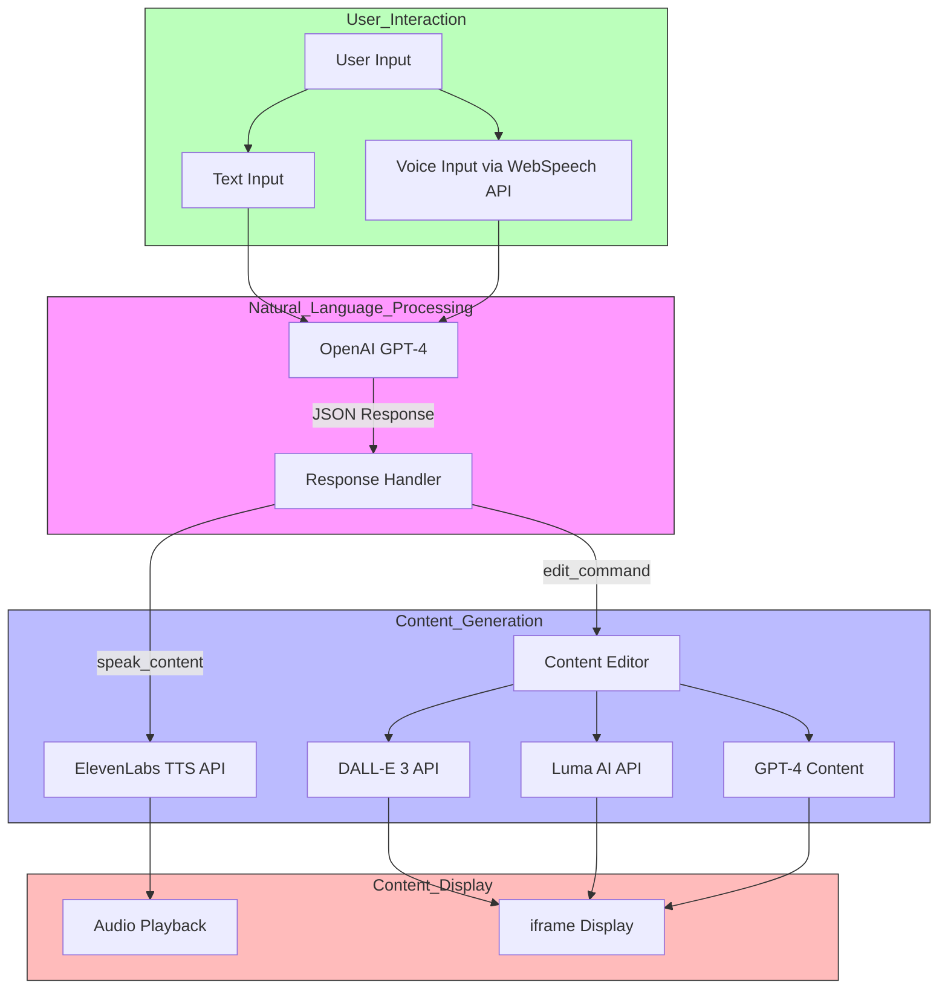

# Docorama - AI-Powered Document Editor

Welcome to **Docorama**, where we are transforming document creation and editing into a hands-free, voice-driven experience. This project is an innovative step towards making content creation seamless and efficient using state-of-the-art AI technology.

## Project Overview

Docorama is an AI-based document editor designed to simplify the process of writing and editing by using voice commands. The goal is to make content creation entirely verbal, providing a smooth, hands-free user experience. The following video demo you see was generated through our **Captions AI**, showcasing the power and efficiency of our technology.
https://github.com/user-attachments/assets/7937a4d8-b857-4e40-9606-601bc066110d

## Key Features

- **AI-Driven Document Editing**  
  Utilizes **Eleven Labs** for speech-to-text conversion, allowing users to dictate content effortlessly. Leverages **OpenAI Whisper** for text-to-speech, enabling clear and natural audio playback.

- **Efficient In-Place Edits**  
  Employs **OpenAI predictive text** to make instant, in-place edits within the document, keeping changes quick and focused without rewriting the entire content.

- **Content Summarization and Script Generation**  
  Uses OpenAI to summarize the document and generate a script for Captions AI. Captions AI creates AI-driven content to serve as an engaging introduction to the document.

## How It Works

1. **Verbal Document Creation**: Users can dictate their documents, and the system transcribes the speech using Eleven Labs' speech-to-text capabilities.
2. **Hands-Free Editing**: Users can verbally command edits, and OpenAI's predictive features make precise modifications.
3. **Document Summarization**: Once the document is finalized, OpenAI summarizes the content, creating a script that Captions AI can use to generate video content.

## Technologies Used

- **Eleven Labs**: For high-quality speech-to-text conversion.
- **OpenAI Whisper**: For natural and accurate text-to-speech functionality.
- **OpenAI Predictive Text**: For efficient and intelligent in-place editing.
- **Captions AI**: For generating engaging AI-driven video content.

## Future Goals

We envision expanding Docorama's capabilities to include more AI-driven features and further enhance the user experience. Our mission is to make document editing and content creation as smooth and efficient as possible.

## User Journey
1. User starts talking to the agents about the topic on which they want to generate an article.
2. The agent brainstorms with users, and starts generating the content for the artile. The content can comprise of text, images and videos.
3. The user then can ask the agent to make any desired changes to the generated content.
4. Once, the document is generated the user can use our summarizer tool to generate a summary.
5. This summary can further be used to generate a short form video representation of the article.

## Contributing

We welcome contributions from the community! Please feel free to submit issues or pull requests to help improve Docorama.

## Contact

For questions or feedback, please reach out to our team at shaikabdulmalik958@gmail.com or sharan.goku19@gmail.com .
